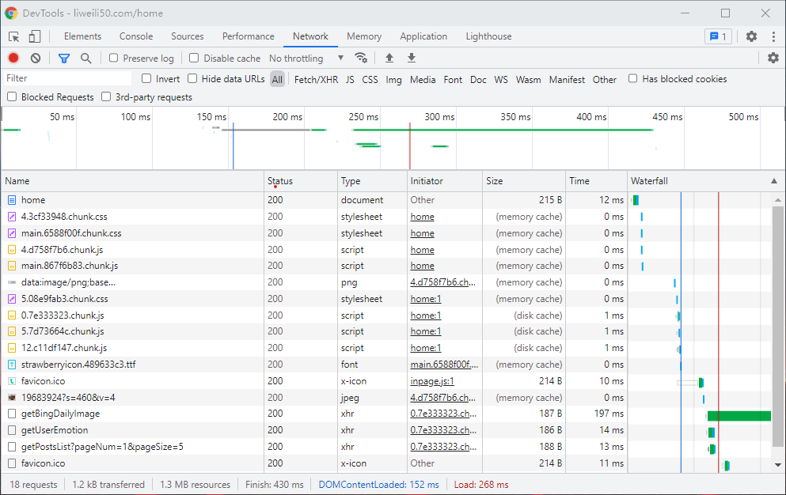

前端代码打包之后的静态资源要部署在服务器上，这时候就要做对这些静态资源做一些运维配置来做性能优化，其中，gzip 和设置 HTTP 缓存是必不可少的。gzip 可以极大的减少数据传输时的体积，合理的缓存机制则会让浏览器减少对资源的请求。

## 使用 nginx 开启 gzip

nginx 默认是不开启 gizp 的，在 Linux 系统上打开 _/etc/nginx/nginx.config_ 文件，在 HTTP 部分可以看到如下配置：

```nginx
# gzip_vary on;
# gzip_proxied any;
# gzip_comp_level 6;
# gzip_buffers 16 8k;
# gzip_http_version 1.1;
# gzip_types text/plain text/css application/json application/x-javascript text/xml application/xml application/xml+rss text/javascript;
```

这些配置默认是被注释的，只需删除#打开注释，再根据需求稍作修改后，重启 nginx 即可。

## HTTP 的强制缓存和协商缓存

HTTP 消息头允许客户端和服务器通过 request 和 response 传递附加信息，利用 Cache-Control 通用消息头字段，通过指定指令来实现缓存机制。
HTTP 缓存分为强制缓存和协商缓存，一个最重要的区别是强制缓存可以直接复用已缓存的静态资源而无需发出请求。
简单介绍一下：

- 强制缓存通常使用 Cache-Control 的 max-age 来设置有效时间， 浏览器会在缓存的有效时间内直接复用缓存。
- 协商缓存是不开启强制缓存时浏览器发送一个携带 Last-Modified 和 Etag 字段的请求来判断缓存资源是否需要重新获取。

这里只大致讲了一下两种 HTTP 缓存的区别以及配置，可见强制缓存有着比协商缓存更快的响应速度，但是却无法感知文件在服务端是否被修改。
协商缓存还是需要发出请求，通过服务器告诉浏览器是否可以继续使用本地缓存。

## 最终方案

结合当前通常使用 webpack 作为构建单页面的基础工具，可以每次构建时都对打包文件重新命名，让强制缓存也能在文件被修改后由于文件名的变更而失效。

所以通过设置 html 为不缓存，html 引用资源都设置为强制缓存，不过每次构建都会对引用的资源重新 hash 命名，就解决了无法及时得知资源更新的问题。

nginx 配置如下：

```nginx
server {
  location / {
    add_header Cache-Control no-cache;
    try_files $uri $uri/ /index.html;
  }

  location ~* \.(css|js|png|jpg|jpeg|gif|gz|svg|mp4|ogg|ogv|webm|htc|xml|woff)$ {
    add_header Cache-Control "public,max-age=7*24*3600";
  }
}

```

实际效果如下图：

